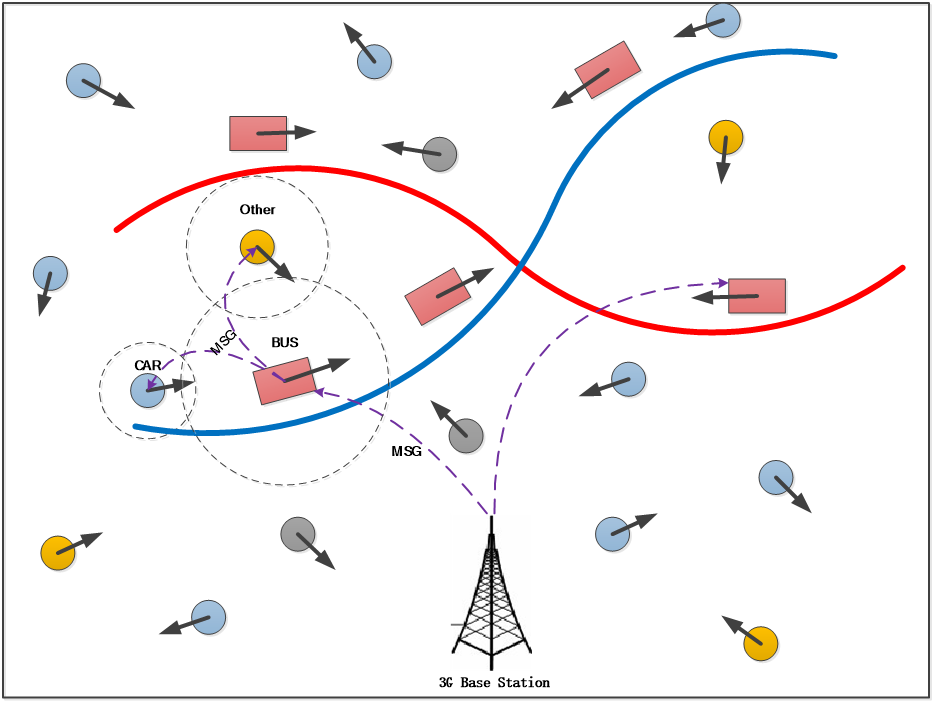
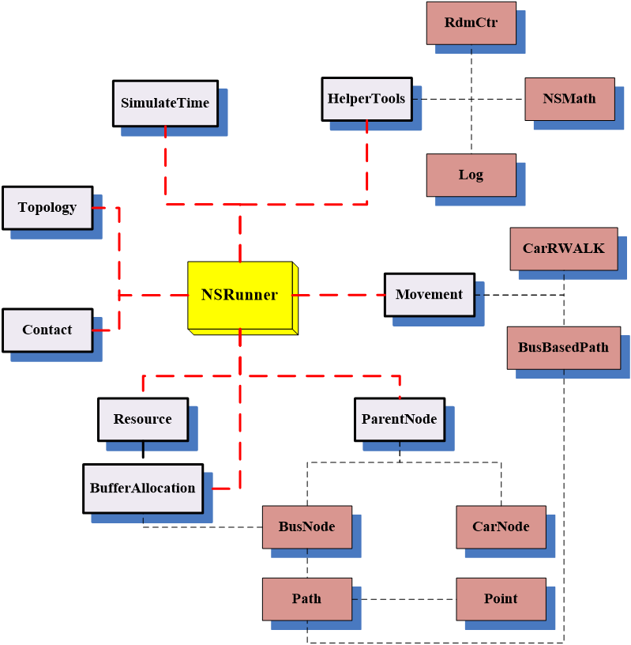

# VANET-Simulator
一个用C++编写的基于离散时间驱动的模拟VANET通信的模拟器
##背景描述  
现如今，爆炸式增长的移动流量数据和用户日益增长的应用程序需求，给蜂窝网络运营商(如3G/LTE)造成巨大的流量负载、网络拥塞和成本维护的压力.为了解决这些数据增长给蜂窝网络造成的压力，研究者提出采用“数据分流”的方案，利用移动节点之间的通信（点到点）来将蜂窝网络数分发（分流）到一部分“中继”用户(称为种子用户或分流用户)，在由中继用户通过本地机会通信(如 Bluetooth、WiFi Direct、DSRC、Device-to-Device in LTE 等)的方式传送给其他订阅的用户，一次来达到减少蜂窝网络流量负载的目的。为了模拟这样的一个数据分流的场景，我们基于车辆网络的通信环境，采用具有相对固定线路的公交车作为中继用户，而普通的车辆作为最终订阅用户，大概的图示如下所示：  
  

##框架学习  
业界最熟悉的网络模拟器莫过于NS2/3和ONE，NS2 多用于研究 MANET，节点移动相对稳定，模拟的参数不好控制，在我们的模型
环境中，模拟的节点是城市中移动的车辆，其中公交车需要遵循预先定义的路径行驶，这在 NS2无法很好的表现。而在 ONE 中，消息或数据的产生是随机的，在任何时候任何时间点任何节点都可以产生消息，当然也可以控制只有一部分节点产生消息，但是更改
节点产生消息的时间需要对其源码进行部分修改；另外，节点之间没有请求响应的路由策略，节点间消息的路由要么采用 single-copy，要么采用 multi-copy 的路由方式。这显然在ONE 中应用我们的模型也不合适。因此，为了更好地模拟该场景，宏观调控消息的产生，节点的移动，相遇的事件等，通过对NS2和ONE源码的阅读和学习，写出了如下的模拟器。下图为ONE的结构图：  
   

##模拟器框架设计与实现 
通过研究NS2和ONE的源码，框架，采用C++实现了一个基于离散时间驱动的简易模拟器：能够模拟公交车和普通车之间的移动、相遇和数据传送等的事件。公交车遵循基于路径的移动模型(Route-Based  Movement，RBM)，普通车遵循随机移动模型(Random Walk，RW)。 在 NS2 和 ONE 中，在结构设计上都有一个掌管全局的类似于上帝的类。该类掌控着模拟器中的所有信息，以及提供了所有操作的函数接口，其他各模块都要为之提供调用的接口。我们的模拟器同样也采用这种设计思想。大概的结构如下图所示：  
   
   
其中，NSRunner 模块就是掌管全局的上帝类，用户只需调用NSRunner 模块中的方法来组织自己的程序，而且在扩展相关的模块的时候都要遵守以 NSRunner 为控制中心，进行组织和扩展.其中主要的几个模块，如移动模型（Bus 采用RouteBasedMovement，而 Car 采用Random  Walk），节点（Node），时间轴（或时间槽，time-slot（SimulateTime），拓扑（Topology），节点相遇事件（Contact），资源缓存分配（BufferAllocation）等.此外，提供了基本辅助操作的小工具模块：HelperTools，如 Trace 文件跟踪记录模块（Log），数学基本操作模块（NSMath），随机函数操作模块（RdmCtr）.在 Log 模块中，用户可以自定义需要记录某些模拟过程中的数据的 Trace 文本文件.它采用了单间类（Singleton）的设计模式，用户只需在 Log.h和 Log.cpp 中添加自定义的文本文件即可，不用考虑在其他模块中添加外部声明等操作。同样，NSRunner模块中整合了这些基本辅助的小工具模块，可在其中寻找所需的接口。  
其中，NSRunner 提供所有类的上层用户接口，包括拓扑的设定、节点（公交车和普通车）的定位和移动、公交车行驶路径的定义和创建、资源的创建、缓存方案的分配、节点的相遇控制、模拟器的时间戳控制、日志信息记录和文件读写等相关操作。  Movement
类为方便扩展，采用枚举类型设计，用户只需在外部宏定义文件中添加相关的移动模型，然后在单独的类文件中实现即可。  BufferAllocation 类利用 Resource 类产生的资源，实现了上节提到的几种缓存分配算法，得到的资源分配结果直接应用于公交车节点，让其存储-携带-转发给其他请求的普通车节点。Contact 类处理节点之间的相遇事件，当两个节点相遇时，处理节点之间的交互事件，由于我们假设节点一次相遇只传输一个 packet，所以，该类没有体现真正的数据传输，而是对数据传输做了一层抽象。通过请求-响应的模式，普通车可以获悉公交车是否存有自己想要的资源。
